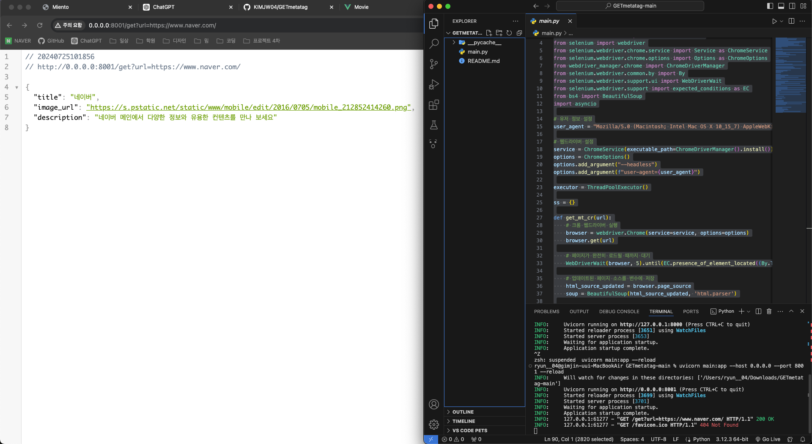

# metatagAPI



사이트의 메타태그를 찾아서 반환해주는 간단한 코드입니다 여기서 반환되는 메타태그는 property가 og:title, og:image, og:description 인 메타태그들의 값들을 반환해줍니다.
변형하여 사용 가능합니다.

사용방법은 만약 로컬환경에서 하게 된다면
http://설정한 내부망 ip:8001/get?url=가져올 사이트 주소
이런식으로 하면 됩니다.

```bash
uvicorn main:app --host 0.0.0.0 --port 8001 --reload
```
실행 명령어 입니다.
ip는 원하시는걸로 설정해주시며 됩니다 내부망 ip입니다
